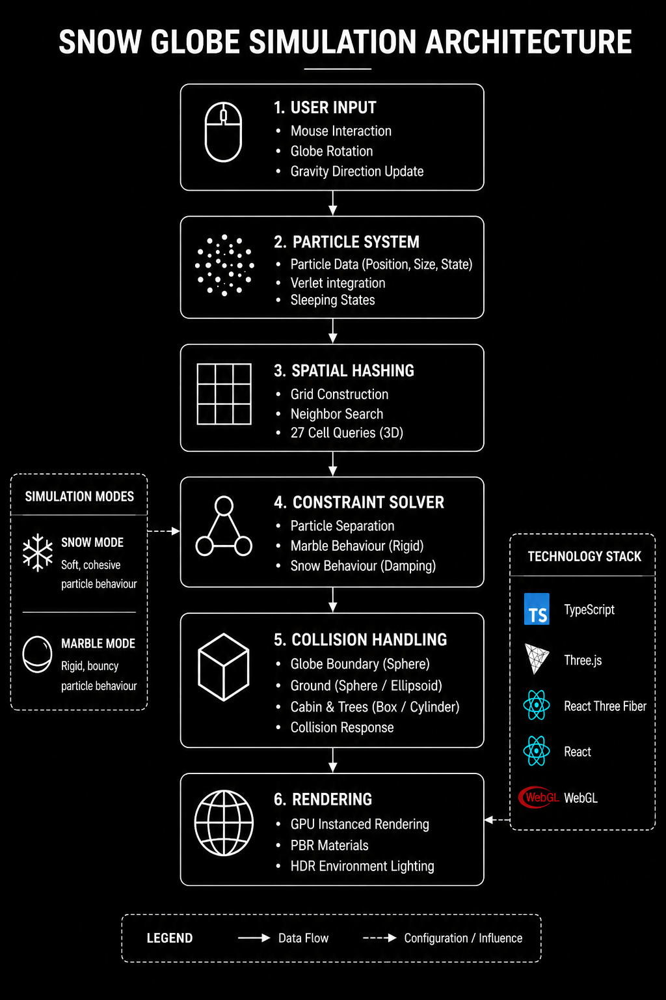
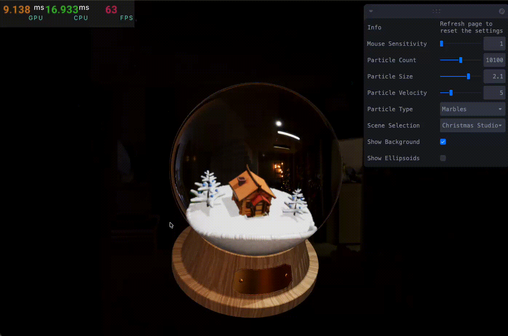
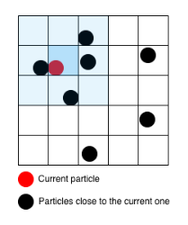

# Real-Time Snow Globe Simulation using Position Based Dynamics


A real-time interactive particle simulation built using Position Based Dynamics (PBD), Verlet Integration, spatial hashing, collision handling, and GPU instanced rendering.

The project explores how particle-based techniques can approximate snow-like behaviour while maintaining stable real-time performance directly inside the browser.

## Live Demo

For a real-time simulation demo, please visit: https://snow-globe-simulation.vercel.app/

## Problem

Real-time particle simulations become computationally expensive as particle counts increase, especially when large numbers of particles must continuously interact and collide in dynamic environments.

This project investigates how Position Based Dynamics, spatial hashing, and particle-based techniques can be combined to create stable and visually convincing snow behaviour while maintaining interactive real-time performance inside a browser environment.

## Key Features

- Position Based Dynamics (PBD)
- Verlet Integration
- Spatial Hashing Neighbor Search
- Snow & Marble Material Behaviours
- GPU Instanced Rendering
- HDR & PBR Rendering
- Interactive Globe Rotation
- Typed Array Particle Storage
- Framerate-Independent Damping
- Browser-Based WebGL Simulation

## System Architecture

<div align="center">
  
</div>

The simulation pipeline begins with user interaction and globe rotation, followed by particle updates using Verlet Integration. Spatial hashing accelerates neighbor searches, while the constraint solver handles particle interactions and applies either snow or marble behaviour. Collision systems keep particles inside the environment, and the final result is rendered using GPU instancing and physically based rendering techniques.

## Simulation Pipeline

```
User Input
    > Particle Integration (Verlet)
        > Spatial Hashing
            > Constraint Solving
                > Collision Handling
                    > Rendering
```

## Demo

<details>
<summary>Snow Simulation</summary>



</details>

<details>
<summary>Marble Simulation</summary>


</details>

<details>
<summary>Performance Testing (FPS)</summary>

| Particle Count | FPS |
|---|---|
| 2,000 | 120 FPS |
| 5,000 | 120 FPS |
| 8,000 | 90 FPS |
| 11,000 | 70 FPS |
| 14,000 | 60 FPS |
| 17,000 | 45 FPS |
| 20,000 | 38 FPS |

</details>

## Mathematical Foundations

### Verlet Integration

Particle movement is calculated using Verlet Integration, a technique commonly used in real-time particle simulations because of its stability and simplicity.

The next particle position is computed using:

$$
x_{t+\Delta t} = x_t + (x_t - x_{t-\Delta t}) + a\Delta t^2
$$

Where:

- $x_t$ is the current particle position
- $x_{t-\Delta t}$ is the previous particle position
- $a$ is acceleration
- $\Delta t$ is the timestep

Instead of storing velocity directly, velocity is reconstructed from the difference between the current and previous positions. This approach works naturally with Position Based Dynamics and helps maintain smooth and stable particle motion during interaction.

### Position Based Dynamics (PBD) Constraints

The simulation uses Position Based Dynamics to prevent particles from overlapping and to maintain stable interactions between neighboring particles.

Particle collision constraints are represented using:

$$
C(p_i,p_j)=\|p_i-p_j\|-d
$$

Where:

- $p_i$ and $p_j$ are particle positions
- $d$ is the minimum allowed distance between particles

If two particles move too close together, the solver pushes them apart until the minimum distance is restored. These corrections are applied iteratively each frame, helping maintain stable particle separation while supporting large numbers of interacting particles.

### Spatial Hashing

<div align="center">
  
</div>

To maintain real-time performance, the simulation uses spatial hashing to accelerate neighbor searches between particles.

A naive collision system would compare every particle against every other particle, resulting in a complexity of:

$$
O(n^2)
$$

As particle counts increase, this quickly becomes too expensive for real-time simulation.

To solve this, the simulation space is divided into grid cells so particles only search nearby regions instead of the entire system. This reduces the average-case complexity to approximately:

$$
O(n)
$$

Grid cell coordinates are calculated using:

$$
cell=\lfloor position/cellSize \rfloor
$$

This optimization significantly reduces collision checks and was essential for supporting thousands of particles while maintaining interactive framerates.

### Collision System

The simulation implements multiple collision constraints to keep particles inside the environment and interacting correctly with scene objects.

The globe boundary is represented using a spherical collision constraint:

$$
x^2+y^2+z^2=r^2
$$

Where:

- $r$ is the radius of the snow globe

If a particle moves outside the sphere, its position is projected back onto the globe surface, preventing particles from escaping the simulation volume.

Additional collision primitives are also used throughout the environment, including:

- Ellipsoid collisions for the snow ground
- Box collisions for the cabin and tree layers
- Cylinder collisions for tree trunks

These simplified collision shapes provide stable environmental interaction while remaining efficient enough for real-time simulation.

## Technology Stack

- TypeScript
- WebGL
- Three.js
- React Three Fiber
- Zustand
- Leva
- SCSS
- Vite
- GPU Instanced Rendering
- Physically Based Rendering (PBR)

## Installation

### Requirements

- Node.js
- npm

Installation guide on how to intall node in your computer: https://nodejs.org/en/download

### Clone the Repository

```bash
git clone <repository-url>
cd <project-folder>
```

### Install Dependencies

```bash
npm install
```

### Start Development Server

```bash
npm run dev
```

## Future Extensions

- GPU-based simulation using WebGPU compute shaders
- Material Point Method (MPM) snow simulation for more physically accurate deformation
- Dynamic snow accumulation and compression systems
- Volumetric rendering and advanced particle shading